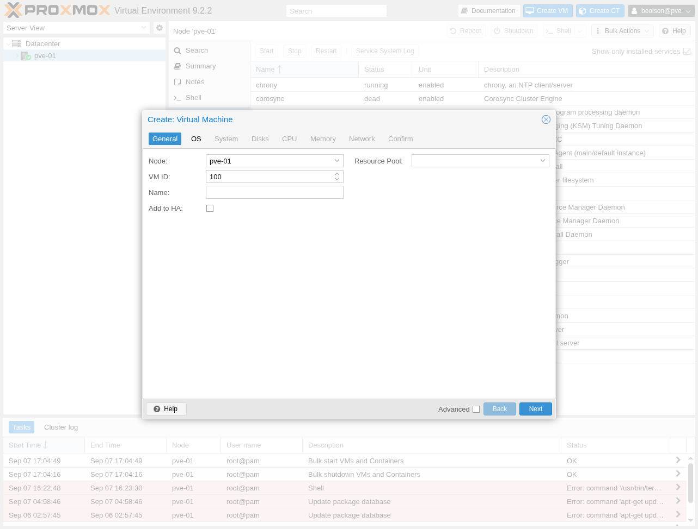
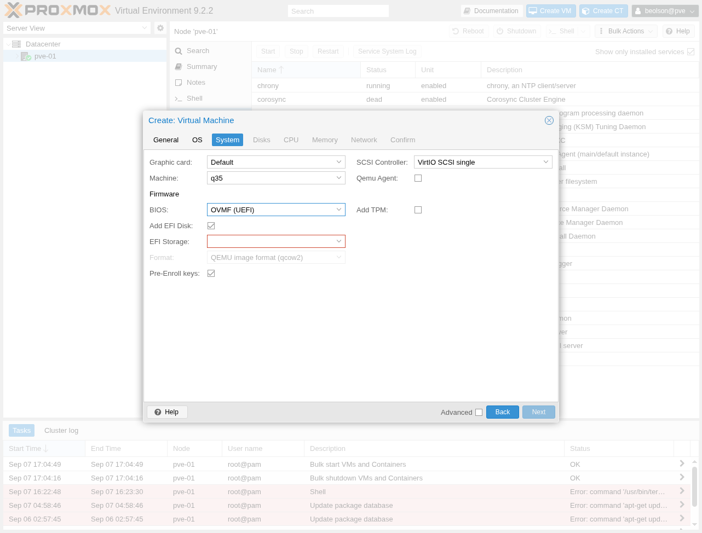

# Create a Proxmox VM with GPU passthrough

## Overview

This guide creates a virtual machine (VM) that has exclusive, near-native access to a physical GPU installed in its Proxmox host. Use it for GPU-accelerated compute, hardware video encoding, or a graphical desktop that is displayed through a monitor connected to the passed-through GPU or through remote-desktop software in the guest.

## Before you begin

Before you begin, ensure you have:

- A Proxmox VE host whose CPU and motherboard support IOMMU (Intel VT-d or AMD-Vi), with IOMMU enabled in the system firmware.
- A GPU that is not needed by the host. A passed-through device is unavailable to the host and to other VMs.
- The host configured to load the `vfio` modules and to bind the GPU (and, where applicable, its HDMI/DisplayPort audio function) to `vfio-pci`. Reboot after updating the kernel command line, modules, or initramfs.
- The GPU in its own IOMMU group, apart from its associated functions, root port, or PCI bridge.
- An installation ISO and the guest operating system’s GPU driver.

On the host, confirm IOMMU is active before creating the VM:

```bash
dmesg | grep -e DMAR -e IOMMU -e AMD-Vi
find /sys/kernel/iommu_groups/ -type l
```

For the complete host preparation procedure, see Proxmox's [PCI(e) passthrough documentation](https://pve.proxmox.com/pve-docs/pve-admin-guide.html#qm_pci_passthrough).

## Create the VM and attach the GPU

1. In Proxmox VE, select **Create VM**. Choose the target node, enter a VM ID and name, then select **Next**.

   

2. On **OS**, select the guest installation ISO and the matching guest type and version. Select **Next**.

3. On **System**, set **Machine** to **q35** and **BIOS** to **OVMF (UEFI)**. Keep **SCSI Controller** set to **VirtIO SCSI single** unless the guest has a specific requirement.

   q35 provides PCIe ports for the VM, and OVMF offers the best GPU passthrough compatibility when the GPU has a UEFI-capable ROM.

   

4. Complete the **Disks**, **CPU**, **Memory**, and **Network** steps for the workload, then select **Finish**. Install the guest operating system, then shut down the VM.

5. Select the stopped VM, open **Hardware**, then select **Add** > **PCI Device**. Choose the physical GPU from the **Raw Device** list.

6. Enable **All Functions** when the GPU has a related audio function. Enable **PCI-Express**. If the GPU will be the guest's primary display adapter, also enable **Primary GPU**; otherwise, leave it disabled for a compute-only GPU.

   Do not assign the same GPU to another VM. If the device is unavailable or Proxmox reports an unsafe IOMMU group, correct the host's IOMMU or VFIO configuration before continuing.

7. Select **Add**, then open **Options** for the VM. Set **Display** to **None** when the passed-through GPU is the primary display. Proxmox's noVNC and SPICE consoles cannot show the physical GPU's framebuffer.

8. Start the VM and install the appropriate NVIDIA, AMD, or Intel guest driver. Verify the guest detects the GPU, then connect a monitor to the GPU or use a remote-desktop service in the guest if you need a graphical desktop.

## See also

- [Proxmox VE PCI(e) passthrough](https://pve.proxmox.com/pve-docs/pve-admin-guide.html#qm_pci_passthrough)
- [Proxmox VE system requirements](https://pve.proxmox.com/pve-docs/pve-admin-guide.html#_system_requirements)
